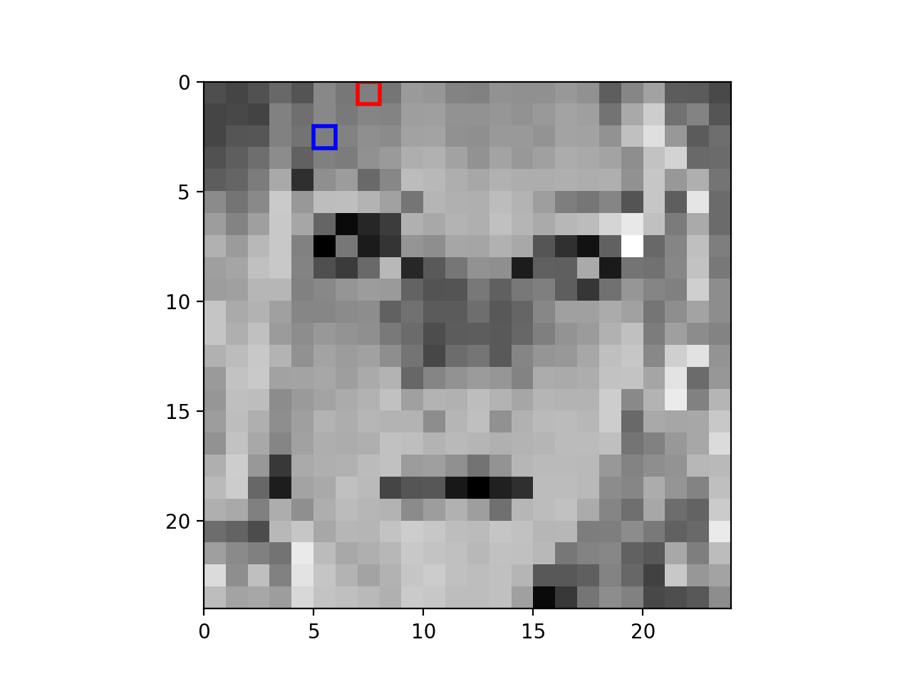

# xSmile

Automatic smile detector based on step-wise regression.

## How does it work?
The algorithm trains a very simple smile classifier that analyzes a grayscale image (24 × 24) and outputs a prediction indicating whether the image is `smiling` or `not`. It makes decision by combining `5` features of the input image through **step-wise regression**, each of which is computed as 

<div align="center">
	
</div>

Step-wise regression is a greedy algorithm: at each round j, choose the jth feature (r1, c1, r2, c2) such that – when it is added to the set of j − 1 features that have already been selected – the accuracy (fPC) of the overall classifier is maximized. 

## Getting Started

### Prerequisites
- Python v3.6.4
- NumPy v1.14.0
- Matplotlib v2.0.2

### Running

To test out the classifier, run the following command in the terminal:

```bash
python3 smile_detector.py 10
```

It should output the accuracy of the algorithm:

```
Accuracy: 1.000000
```

and show a figure of the selected feature:

<div align="center">
	
</div>

## Author

- **Yang Liu** - *Initial work* - [byliuyang](https://github.com/byliuyang)

## License
This project is licensed under the MIT License