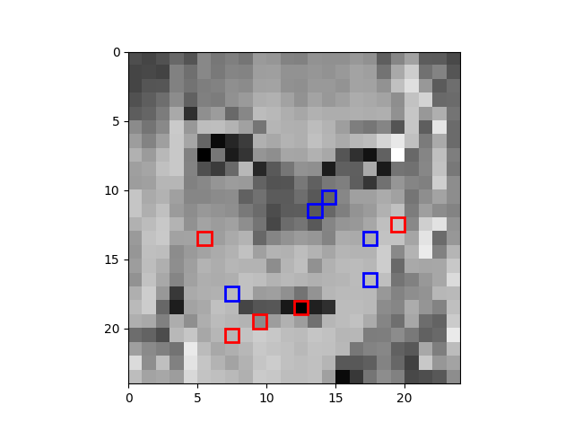
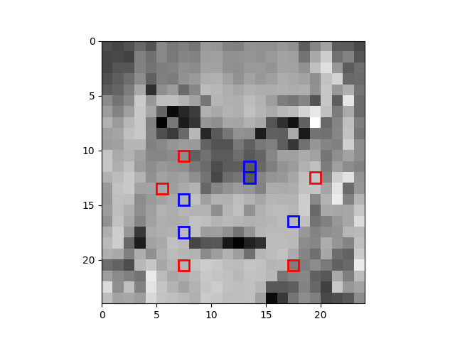

# xSmile

Automatic smile detector based on step-wise regression.

## How does it work?
The algorithm trains a very simple smile classifier that analyzes a grayscale image (24 × 24) and outputs a prediction indicating whether the image is `smiling` or `not`. It makes decision by combining `5` features of the input image through **step-wise regression**, each of which is computed as 

<div align="center">
	
</div>

Step-wise regression is a greedy algorithm: at each round j, choose the jth feature (r1, c1, r2, c2) such that – when it is added to the set of j − 1 features that have already been selected – the accuracy (fPC) of the overall classifier is maximized. 

## Getting Started

### Prerequisites
- Python v3.6.4
- NumPy v1.14.0
- Matplotlib v2.0.2

### Running

To test out the classifier, run the following command in the terminal:

```bash
python3 smile_detector.py 10
```

It should output the accuracy of the algorithm:

```
Accuracy: 1.000000
```

and generate a image of the selected features:

<div align="center">
	
</div>

## Performance
| Size of Training Set | Training Accuracy | Testing Accuracy | Selected Features |
|---|:----:|----:|:----:|
|400 | 0.825436 | 0.735777 |  |
| 800 | 0.802747 | 0.740700 |  |
| 1200 | 0.801832 | 0.760394 |  |
| 1600 | 0.788882 | 0.763676 |  |
| 2000 | 0.784000 | 0.752735 |  |

### Accuracies vs the number of images in the training set

 

In the figure, as the number of training set increases, the training accuracy decreases. The testing accuracy, however, first increases then starts decreasing after the size of training set reached 1600. We can see that the two curves are gradually getting close to each other. The decrease of training accuracy and the increase of testing accuracy indicate that the model is getting less and less overfitted as the size of training set increases.

## Author

- **Yang Liu** - *Initial work* - [byliuyang](https://github.com/byliuyang)

## License
This project is licensed under the MIT License